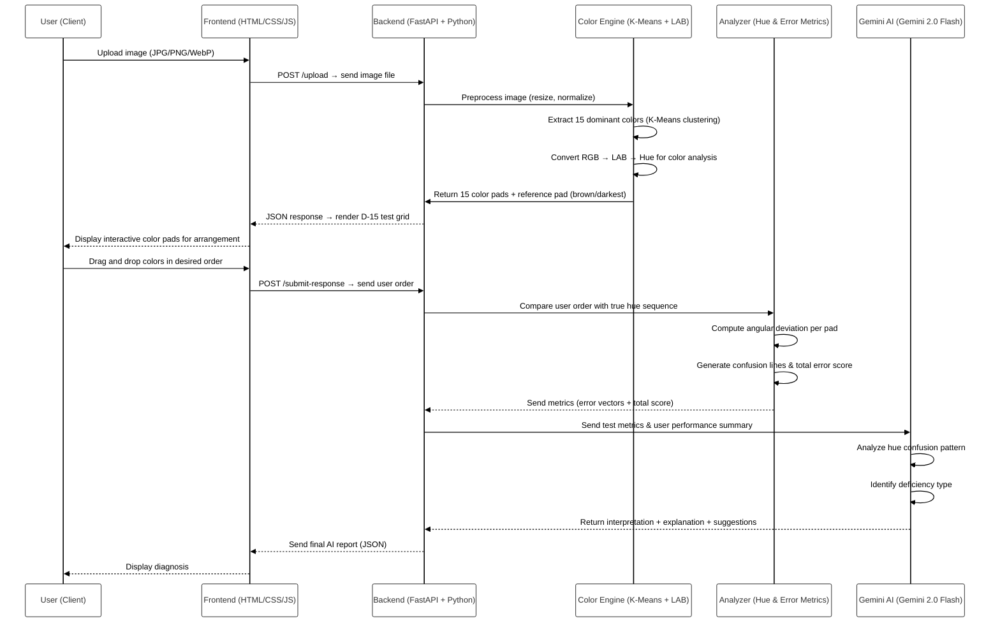

# AI-colour-vision-test

🎨 **AI-Powered D-15 Color Vision Testing System**

A clinical-grade web application that detects color vision deficiencies (color blindness) through an interactive D-15 color arrangement test using AI and color science.

## Flowchart


---


## Features

- 🔍 **Detects 5 Types of Color Vision**:
  - Normal Vision
  - Protanopia (Red-cone loss) - Red-Green Blindness
  - Deuteranopia (Green-cone loss) - Red-Green Blindness
  - Tritanopia (Blue-cone loss) - Blue-Yellow Blindness
  - Monochromacy (Complete color blindness)

- 📊 **Severity Classification**: Mild / Moderate / Severe / Complete
- 🧬 **Color Science**: Uses CIE LAB color space for accurate analysis
- 🤖 **AI Classification**: Random Forest ML model
- 💡 **Medical Recommendations**: Detailed guidance for each deficiency type

## Quick Start

### Prerequisites
- Python 3.8+
- pip

### Installation

1. Clone the repository:
```bash
git clone https://github.com/harshaagrawal20/AI-colour-vision-test.git
cd AI-colour-vision-test
```

2. Create virtual environment and install dependencies:
```bash
cd color-vision-ai
python -m venv venv_cv
venv_cv\Scripts\activate  # Windows
# source venv_cv/bin/activate  # Linux/Mac

pip install -r requirements.txt
```

### Running the Application

1. Start the backend server:
```bash
cd backend
python main.py
```
Backend runs on: http://localhost:8000

2. Start the frontend server (in a new terminal):
```bash
cd frontend
python -m http.server 8080
```
Frontend runs on: http://localhost:8080

3. Open your browser and go to: **http://localhost:8080**

## How to Use

1. **Upload an Image**: Click to upload any natural image (JPEG, PNG, WebP)
2. **Arrange Colors**: Drag and drop 15 color patches horizontally in order
3. **Submit**: Click "Submit Response" to get your results
4. **View Results**: See your color vision classification, severity, accuracy score, and recommendations

## System Architecture

### Backend (FastAPI)
- **Color Extraction**: K-Means clustering in LAB color space
- **D-15 Test Generation**: 15 colors with shade variants
- **Error Analysis**: LAB distance metrics
- **AI Classification**: Random Forest classifier

### Frontend (HTML5 + JavaScript)
- **Interactive UI**: Drag-and-drop color arrangement
- **Responsive Design**: Works on desktop and mobile
- **Real-time Feedback**: Instant results display

## Color Science

The system uses:
- **CIE LAB color space** for perceptually uniform color analysis
- **L-channel**: Luminance (brightness)
- **a-channel**: Red-Green axis
- **b-channel**: Yellow-Blue axis

Error patterns in specific channels indicate different types of color blindness.

## Medical Disclaimer

⚠️ **Important**: This tool is a **screening aid**, NOT a diagnostic tool.
- Always confirm results with a professional eye care specialist
- For rare deficiencies (Tritanopia/Monochromacy): Seek immediate medical evaluation
- Results depend on monitor calibration and lighting conditions

## Documentation

- 📄 [Complete User Guide](D15_COLOR_VISION_TEST_GUIDE.md)
- 📄 [Implementation Details](IMPLEMENTATION_UPDATE.md)

## Technologies Used

- **Backend**: FastAPI, Python, OpenCV, NumPy, scikit-learn
- **Frontend**: HTML5, CSS3, Vanilla JavaScript
- **Color Science**: CIE LAB color space
- **Machine Learning**: Random Forest Classifier

## License

Research & Educational Use

## Contributing

Contributions are welcome! Please feel free to submit a Pull Request.

## Support

For issues or questions, please open an issue on GitHub.

---

**Version**: 1.0.0  
**Last Updated**: November 4, 2025


